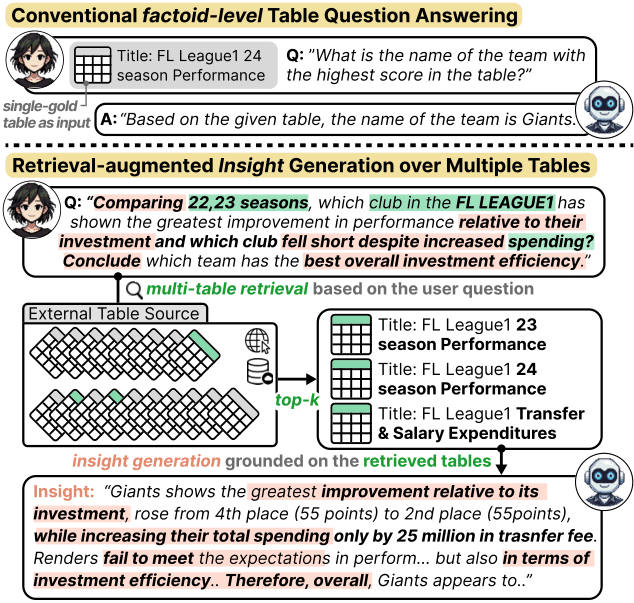
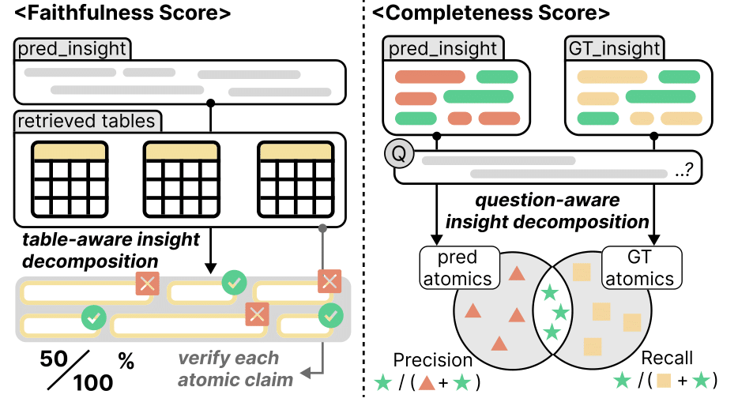
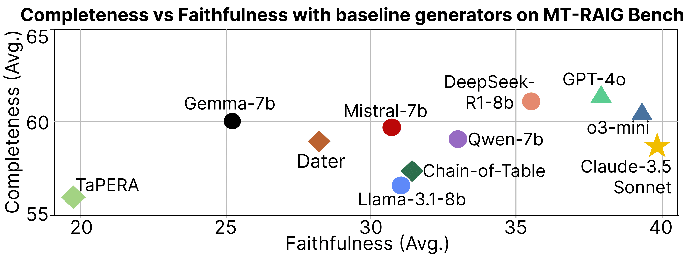

#  MT-RAIG: Novel Benchmark and Evaluation Framework for Retrieval-Augmented Insight Generation over Multiple Tables

Recent advancements in table-based reasoning have expanded beyond factoid-level QA to address insight-level tasks, where systems should synthesize implicit knowledge in the table to provide explainable analyses. Although effective, existing studies remain confined to scenarios where a single gold table is given alongside the user query, failing to address cases where users seek comprehensive insights from multiple unknown tables.

To bridge these gaps, we propose **MT-RAIG Bench**, design to evaluate systems on Retrieval-Augmented Insight Generation over Mulitple-Tables. Additionally, to tackle the suboptimality of existing automatic evaluation methods in the table domain, we further introduce a fine-grained evaluation framework **MT-RAIG Eval**, which achieves better alignment with human quality judgments on the generated insights.

## MT-RAIG Bench

MT-RAIG BENCH is the first largescale benchmark for retrieval-augmented insight generation over multiple tables.

**Data Fields**

| Key               | Type        | Description                                                                                                                  |
| ----------------- | ----------- | ---------------------------------------------------------------------------------------------------------------------------- |
| gold_table_id_set | List\[str\] | Multi table ID set                                                                                                           |
| question          | str         | Question                                                                                                                     |
| insight           | str         | Insight                                                                                                                      |
| type              | str         | Question type   - Analysis & Summary   - Comparsion & Relationship   - Performance & Outcome   - Trend & Pattern |

**Data Example**

    # mt_raig_bench/benchmark.json
    ...
    {
        "gold_table_id_set": [
            "353b5a735823259229c1cd8b861de8c4e1c7dd1452a1c30b8750f627cb9c84a0",
            "52576d95871a6c91e63a18d751b2410d5f3d472a482be37bb723f21fc32db9fc",
            "d63aafdaee8d21e324e638268db5d91c4c55e92545671847d778235d7828c421",
            "e779833152fd9ac418c1844d361cb02450a964703a2c3b36e1f54e4735e07f03"
        ],
        "question": 
            "How do the grading systems for the IPPT Award Badge across the Singapore Air Force, Singapore Armed Forces, Singapore Civil Defence Force, and Singapore Police Force compare, and what implications might these differences have for the training and assessment of personnel in each organization?",
        "insight":
            "The grading systems for the IPPT Award Badge across the Singapore Air Force, Singapore Armed Forces, Singapore Civil Defence Force, and Singapore Police Force exhibit notable differences in performance metrics and scoring criteria, which can significantly impact the training and assessment of personnel in each organization. For instance, the Singapore Air Force requires fewer chin-ups for higher grades compared to the Singapore Armed Forces and Singapore Civil Defence Force, where more than 10 and 11 chin-ups are necessary for top grades, respectively. ...", 
        "type": "Comparison & Relationship"
    }
    ...

**Table Fields**

| Key    | Type                | Description                           |
| ------ | ------------------- | ------------------------------------- |
| id     | str                 | Unique table ID                       |
| title  | str                 | Table title seperated by vertical bar |
| header | List\[str\]         | Table header                          |
| cell   | List\[List\[str\]\] | Table cells                           |

**Table Example**

    # mt_raig_bench/table_corpus.json
    ...
    {
        "id":
            "e375a314c6dd0c542664b13c5cff485926ce9aa90f3c7fa3f9249bd066152e94",
        "title":
            "farm - city",
        "header": [
            "City_ID",
            "Official_Name",
            "Status",
            "Area_km_2",
            "Population",
            "Census_Ranking"
        ],
        "cell": [
            ["1", "Grand Falls/Grand-Sault", "Town", "18.06", "5706.0", "636 of 5008"],
            ["2", "Perth-Andover", "Village", "8.89", "1778.0", "1442 of 5,008"],
            ["3", "Plaster Rock", "Village", "3.09", "1135.0", "1936 of 5,008"],
            ["4", "Drummond", "Village", "8.91", "775.0", "2418 of 5008"],
            ["5", "Aroostook", "Village", "2.24", "351.0", "3460 of 5008"]
        ]
    }
    ...

## MT-RAIG Eval

MT-RAIG EVAL is a novel decomposition-based evaluation framework that enables finer distinctions in assessing the quality of the long-form outputs.

To evaluate the generated insights, run the following command:

    python main.py \
        --baseline={Baseline generator name, e.g. o3-mini, GPT-4o, DeepSeek-R1-8B, ...} \
        --path-dir={Input data folder, default: mt_raig_bench}

## Result

